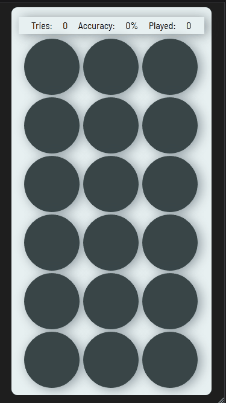

# codematch
A mobile first, software development themed memory match game built using HTML, CSS, and JavaScript

## Technologies Used
- HTML
- CSS
- JavaScript
- FontAwesome
- GoogleFonts
- Amazon Web Services EC2

## Live Demo
[codematch](https://memory-match.jackmchou.com/)

## Features
- User Can View Game
- User Can Flip Cards
- User can Match Two Cards
- User Can Win Game
- User Can View Stats
- User Can Reset Game and Play Again
- V2 -- _in progress, stay tuned!_

## Preview


## Development

#### System Requirements
|   Requirement   |     Version      |
|-----------------|-----------------:|
| Visual Studio Code|  1.43 or higher  |

#### Getting Started
1. Clone the repository
  ```shell
  git clone https://github.com/jackmchou/codematch.git
  ```
2. Change directory to cloned folder
  ```shell
  cd codematch/
  ```
3. Open with Live Server in VS Code via ```index.html```